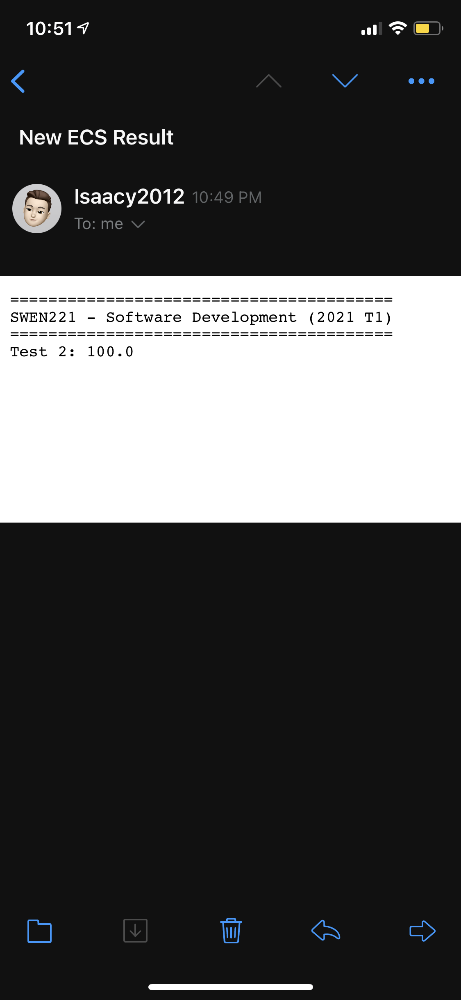

# GetGradeECS
## Get grades from ECS Assessment Marks


<p float="left">
  
</p>

<b>Sends an email on new result</b>

GetGrade checks the ECS Assessment marks every 15-30 minutes (random to stop accidentally synchronizing and overloading the server if there are many users) to check if there is a new result. If there is, it uses your gmail account and sends you an email!

<b>Automatic login</b>

Automatically logs into the ECS Assessment Marks page by encrypting and storing your username and password.

<b>Active Hours</b>

Only check the site if within active hours. Set the active hours by editing "settings.ini" (generated after first run) and setting active_hours like so:

```
[SETTINGS]
email = ...
username = ...
password = ...
active_hours = 9-17

```

This settings.ini would mean that the active hours are between 9am and 5pm.

# Logging
Logging outputs to log.txt:

```
Email sent at: 2021-06-10 22:49:05
=================NEW RESULTS=================
========================================
SWEN221 - Software Development (2021 T1)
========================================
Test 2: 100.0

=============================================
Sleeping for: 15.02 minutes, until 2021-06-10 23:04:07
```


